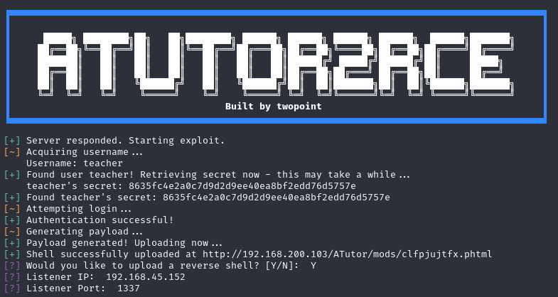

# ATutor2RCE
The learning management framework ATutor version 2.2.1 contains multiple vulnerabilities which can be chained together to achieve unauthenticated remote code execution. This script simplifies the process by automating blind SQL injection, custom file generation and upload bypass, and reverse shell generation.

## Usage
ATutor2RCE usage is about as painless as it gets.
```
usage: ATutor2RCE.py [-h] ip

positional arguments:
  ip          IP of ATutor server.

options:
  -h, --help  show this help message and exit
```
## Output
A successful execution of the script should look like this:

## Caveats
I strongly recommend reviewing the source code if you experience any issues and diagnosing your problem as you see fit. The following is a list of assumptions the script makes:
- The first user in the AT_Members database is a teacher and has test import privileges.
- The user is enrolled in a course with a valid course ID.
- The PHP function `SYSTEM()` is enabled.
- The webroot of the ATutor instance is `/var/www/html/ATutor`.
